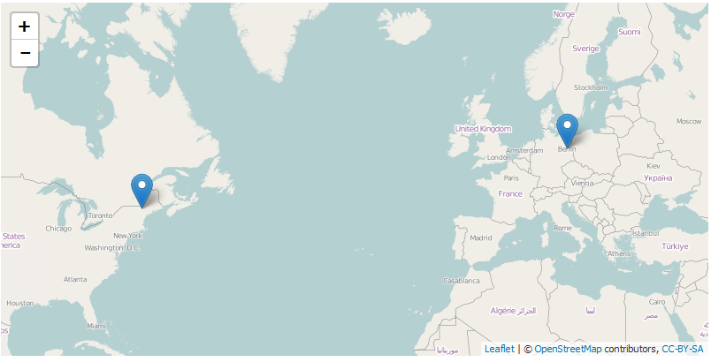
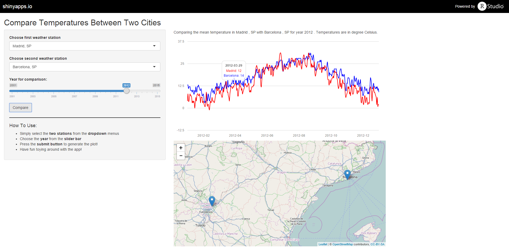

### Have You Ever Asked Yourself...

* ... whether the summer is colder in your town than in for example New York?
* ... how much colder the winter in Moscow is than in Los Angeles?
* ... how warm it was on your birthday 3 years ago?
* ... what was the hottest day in your city last year?


The Shiny App weatherCompare answers these questions...

* ... for 5000 cities world-wide
* ... with tempearture data dating back as far as 2001
* ... using the wunderground.com database
* ... presenting the data in a visually appealing way
* ... helping you pick the right weather station

--- &twocols 

### The App Is Made Up of a Side Bar Panel Used For Controlling the Input

*** =left

* Select the cities to compare from the dropdown menus
    * Mainly airport weather stations are in the wunderground.com database
* A slider lets you select the year of interest
    * Go back as far as 2001. If data is missing the plot will interpolate or in case of no data be empty
* Press the "Submit" button to do the comparison

*** =right

<br>
<br><br>


--- &twocols

### The Result Will Be A Graph Plotting The Temperature Data for the Two Cities

*** =left

* An interactive graph is created using the R 'rCharts' package, just like the graph to the right

*** =right

```{r,results = 'asis',comment = NA, message = F, echo = F,cache=TRUE}
library(rCharts)
library(weatherData)
library(knitr)
library(base64enc)
options(RCHART_WIDTH = 580)
comb_df <- read.table("lon_par_comp.df",stringsAsFactors = FALSE)

m1 <- mPlot(x = "Date",y=c("mean_st1","mean_st2"),type="Line",data=comb_df,
                        labels=list("London","Paris"))
m1$set(pointSize = 0, lineWidth = 2)
m1$set(lineColors=c("red","blue"))
m1$save('interactivechart.html',standalone = TRUE)
```

<iframe src ='interactivechart.html', width = "620px", height = "450px"></iframe>
--- &twocols

### A Map Will Help You Validate Your Choice Of Weather Stations

*** =left

* Weather station names might be ambiguous
    * I spent a lot of time looking at data from Berlin (New Hampshire), US instead of Berlin, Germany...

* Therefore an interactive leaflet map will reactively adjust to your choice of weather stations marking their positions

*** =right
<br>


<br>


---

### Go Ahead And Try It On Shinyapps.io!
<p>
Just click on the screenshot!
</p>

<a href="https://jludewig.shinyapps.io/weatherCompare/">

</a>
